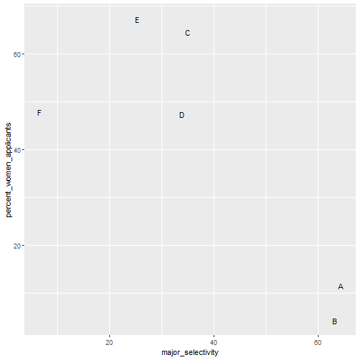
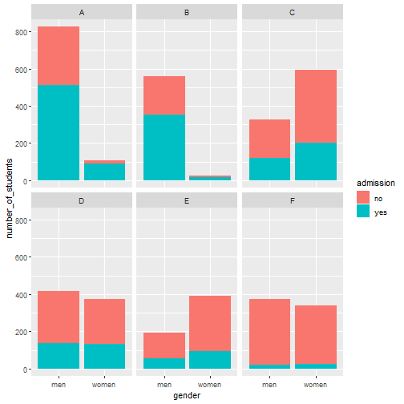
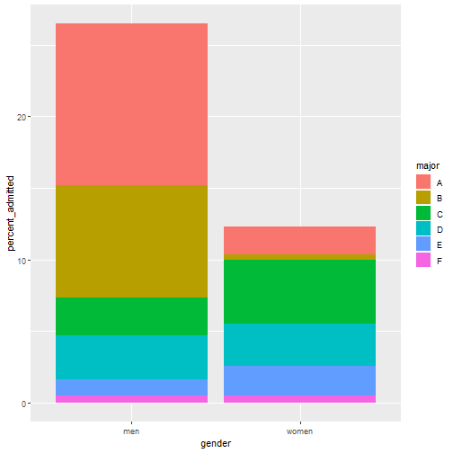
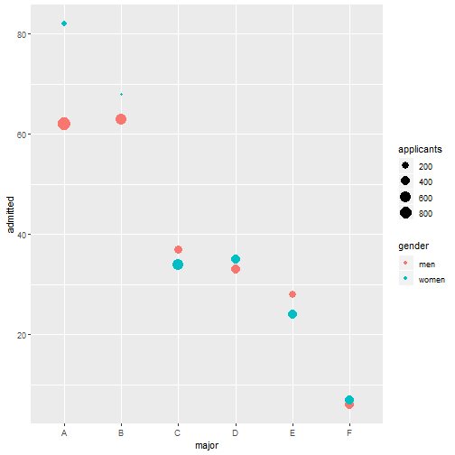

# IS THERE GENDER BIAS?


## 1. INTRODUCTION

In this case study, we demystify the fact that male applicants are favoured more than their female counterparts when it comes to admissions. The data is provided by UC Berkeley.
We'll analyse the data by measuring the correlation between the two data sets used to claim gender bias then introduce a confounder to deny the hypothesis. Otherwise known as the Simpson's paradox.

## 2. METHODS AND ANALYSIS

## 2.1 Work Environment and Data Preparation

For this project, we'll use the following libraries


```r
if(!require(tidyverse)) 
  install.packages("tidyverse", repos = "http://cran.us.r-project.org")
if(!require(dslabs)) 
  install.packages("dslabs", repos = "http://cran.us.r-project.org")
if(!require(broom)) 
  install.packages("broom", repos = "http://cran.us.r-project.org")
if(!require(knitr)) 
  install.packages("knitr", repos = "http://cran.us.r-project.org")
if(!require(rmarkdown)) 
  install.packages("rmarkdown", repos = "http://cran.us.r-project.org")
```

The required dataset is contained in the dslabs package which we just loaded. We proceed by loading the data using the code


```r
data(admissions)
```


## 2.2 Data Exploration
Here is the data


```r
admissions
```

```
##    major gender admitted applicants
## 1      A    men       62        825
## 2      B    men       63        560
## 3      C    men       37        325
## 4      D    men       33        417
## 5      E    men       28        191
## 6      F    men        6        373
## 7      A  women       82        108
## 8      B  women       68         25
## 9      C  women       34        593
## 10     D  women       35        375
## 11     E  women       24        393
## 12     F  women        7        341
```

It consists of

- The majors/departments include


```r
unique((admissions$major))
```

```
## [1] "A" "B" "C" "D" "E" "F"
```

- A total number of **4526** applicants with **479** admitted


```
## # A tibble: 1 x 2
##   total_admitted total_applicants
##            <dbl>            <dbl>
## 1            479             4526
```

- Among men and women


```
## # A tibble: 2 x 3
##   gender admitted applicants
##   <chr>     <dbl>      <dbl>
## 1 men         229       2691
## 2 women       250       1835
```

Percentage wise **44.5%** of total men and **30.3%** of total women had their applications approved


```r
admissions %>% group_by(gender) %>% 
  summarize(percentage = 
              round(sum(admitted*applicants)/sum(applicants),1))
```

```
## # A tibble: 2 x 2
##   gender percentage
##   <chr>       <dbl>
## 1 men          44.5
## 2 women        30.3
```


## 2.3 Data Analysis and Visualization

We begin by testing whether gender and admission are independent


```r
admissions %>% group_by(gender) %>% 
  summarize(total_admitted = round(sum(admitted / 100 * applicants)), 
            not_admitted = sum(applicants) - sum(total_admitted)) %>% 
  select(-gender) %>% 
  do(tidy(chisq.test(.)))
```

```
## # A tibble: 1 x 4
##   statistic  p.value parameter method                                      
##       <dbl>    <dbl>     <int> <chr>                                       
## 1      91.6 1.06e-21         1 Pearson's Chi-squared test with Yates' cont~
```

A statistical test, the chi-squared test, clearly rejects the hypothesis that gender and admissions are independent as the p value (**1.06e-21**) is very small.

Following the findings above, we now evaluate the difference in admissions by gender


```r
admissions %>% select(major, gender, admitted) %>% 
  spread(gender, admitted) %>%
  mutate(women_minus_men = women - men)
```

```
##   major men women women_minus_men
## 1     A  62    82              20
## 2     B  63    68               5
## 3     C  37    34              -3
## 4     D  33    35               2
## 5     E  28    24              -4
## 6     F   6     7               1
```

Four majors favor women over men. These are **A, B, D and F**.

The paradox is that analyzing the totals suggest a dependence between admissions and gender. But when the data is grouped by major, this dependence seems to disappear. Clearly, Z (major) is associated with Y (females), because the more selective a major, the lower the probability that someone enters that major.

Is major selectivity associated with gender? Let's plot total percent admitted to major versus percent women applicants



The plot suggests that women were much more likely to apply to the two hard majors. Gender and major selectivity are confounded.
Major E is much harder to enter than major B. And over 60% of applicants to major E were women, while less than 30% of the applicants of major B were women.





This breakdown lets us see that the majority of accepted men came from two majors, A and B. It also lets us see that few women apply to these two easy majors.

Now let us compare the number of applicants per gender



The size of the dot represents the number of applicants, and explains the paradox. We see large red dots and small blue dots for the easiest majors, A and B.

If we first stratify by major, compute the difference, and then average, we find that the percent difference is actually quite small.


```r
admissions %>%  group_by(gender) %>% summarize(average = mean(admitted))
```

```
## # A tibble: 2 x 2
##   gender average
##   <chr>    <dbl>
## 1 men       38.2
## 2 women     41.7
```


## 4. CONCLUSION

In our first analysis we see that **44.5%** of men and **30.3%** of women got accepted from the total number of applicants. But on further analysis, if we first stratify by major, compute the difference, and then average, we find that the percent difference is actually quite small with **38.2%** men and **41.7%** women. We can then conclude that there is no gende bias.
